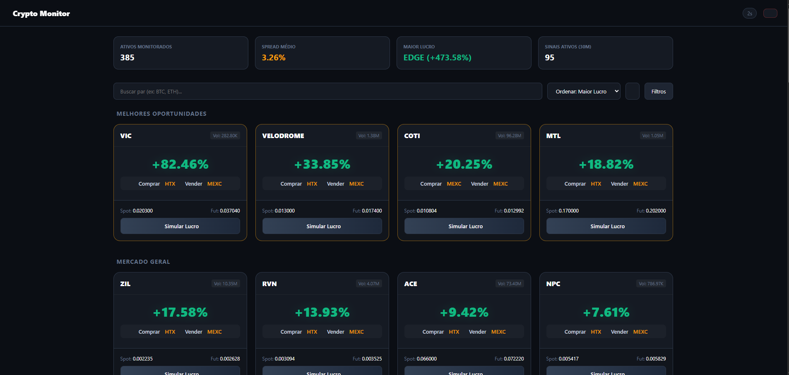
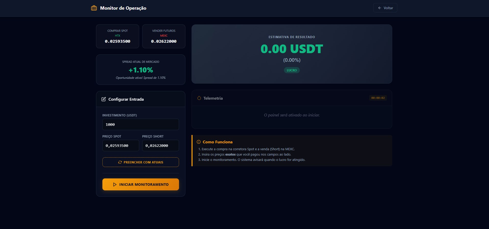

# 🚀 Crypto Monitor - Monitor de Arbitragem de Alta Frequência

Um sistema robusto desenvolvido para monitorar oportunidades de arbitragem (Surebets) no mercado de criptomoedas em tempo real. A aplicação rastreia divergências de preços entre mercados Spot e Futuros para identificar spreads lucrativos de forma automatizada.

---

## 📸 Demonstração da Aplicação

  <h3>Visão Geral do Sistema (GIF)</h3>
  
Demonstração em tempo real do monitoramento de ativos e sinais de arbitragem.

  

  <h3>Dashboard de Oportunidades</h3>
  
Visão geral do mercado, estatísticas e listagem de sinais ativos.

  

    

  <h3>Calculadora de PnL</h3>
  
Ferramenta visual para simulação e rastreio de lucro líquido com base no investimento inicial.

  

    

  <h3>Painel Administrativo</h3>
  
Gestão de usuários, status de contas e prazos de expiração do sistema.

  

    

  <h3>Tela de Login</h3>
  
Interface de autenticação segura e criptografada.

  

---

## 🌟 Principais Funcionalidades

* **Monitoramento Multi-Exchange:** Integração com APIs de grandes corretoras (MEXC, Gate.io e HTX) para os mercados Spot e Futuros.
* **Detecção de Spreads e Sinais:** Identifica o momento exato de divergência de preços e calcula o histórico de cruzamentos em janelas de 30 minutos e 24 horas.
* **Simulador de Operações (PnL):** Calculadora integrada para estimar lucros líquidos descontando as taxas de corretagem.
* **Painel Administrativo:** Gestão completa de controle de acesso de usuários, status de contas e prazos de expiração.
* **Segurança Avançada:** Sistema de autenticação baseado em tokens JWT com cookies seguros e proteção contra CSRF.

---

## 🛠️ Tecnologias Utilizadas

* **Linguagem & Core:** Python, Flask, SQLite.
* **Autenticação & Segurança:** PyJWT, Werkzeug Security (Hashing de senhas).
* **Automação & Scraping:** Playwright (Assíncrono).
* **Front-end:** HTML5, CSS3 Customizado (Design System próprio focado em Dark Mode), JavaScript (Vanilla).

---

### ⚠️ Nota de Privacidade
*O código-fonte deste projeto é proprietário e mantido em um repositório privado. Este espaço é dedicado exclusivamente à exibição técnica do portfólio.*

---

## 👨‍💻 Autor

Desenvolvido por **Rodrigo Carvalho Lima**  
*Full Stack Software Developer & Data Analyst*

